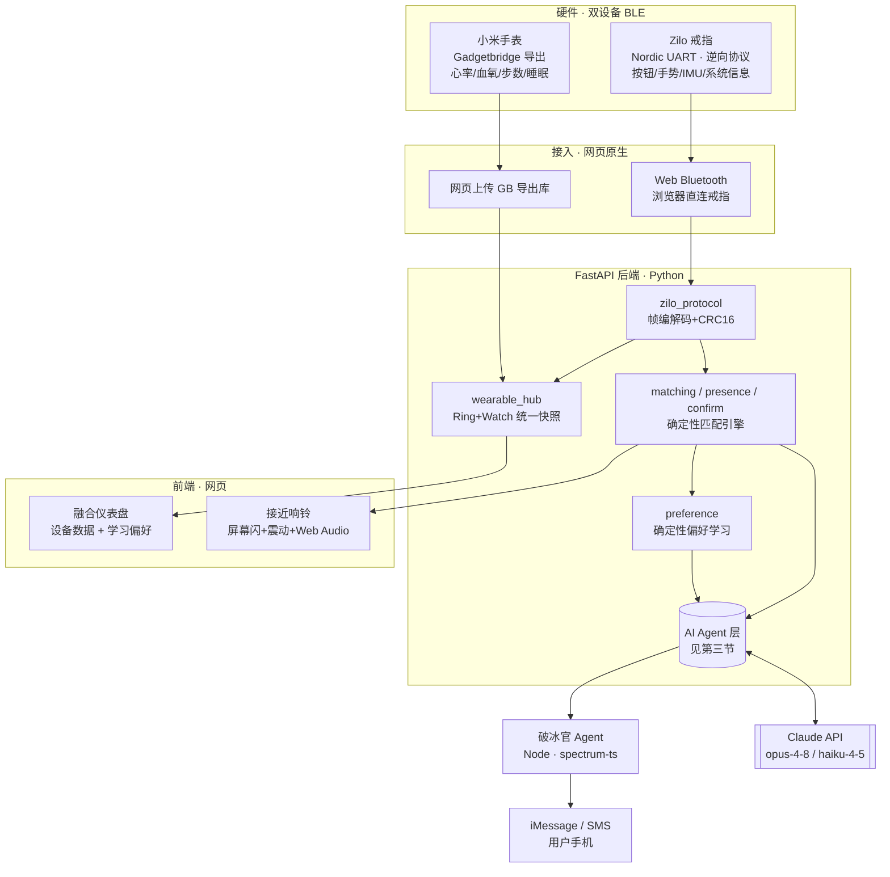
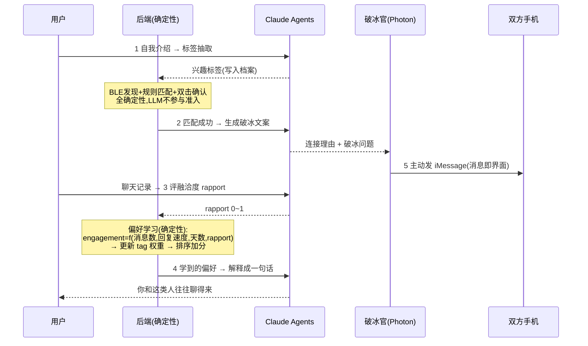

# RedSignal 红信号 · 伴身智能的线下轻社交

> **一句话**：戴上智能戒指，走进人群。附近有与你适配的人靠近时，手机轻轻震动闪烁——**双方各自双击戒指**确认愿意认识，一个**有手机号的 AI 破冰官**就主动给你俩发 iMessage 开场。你聊得越投机，算法越懂你「还会喜欢哪类人」。

RedSignal 把**可穿戴硬件（Zilo 戒指 + 小米手表）**、**BLE 近场发现**、**一组分工明确的 AI Agent** 和**确定性的匹配/学习引擎**缝合成一条完整闭环：从「感知」到「相遇」到「破冰」到「越用越懂你」。

- 反算法、反信息轰炸：发现只发生在**线下、匿名**；是否交换资料由**确定性代码**决定，LLM 不参与准入。
- AI Agent 只站在**语义边缘**（读懂文字、生成语言、判断投机度），**核心匹配/学习是确定性的**——安全、可复现、可解释。
- 生理数据（心率/血氧）**只做个人展示**，**绝不进入匹配**（设计红线）。

---

## 一、整体架构



**闭环时序**：
```
录入自我介绍 ─[标签抽取 Agent]→ 兴趣标签
   → 手机 BLE 匿名发现 + 规则匹配(确定性) → 适配且持续存在
   → 接近响铃(手机端，越近越急) → 双方各自双击戒指(0x0703)
   → 双向确认 → [破冰 Agent]生成文案 → [破冰官 Agent]主动发 iMessage 给双方
   → 双方开始聊天 → [融洽度 Agent]评分 → 偏好学习(确定性)更新权重
   → 下次匹配「你也喜欢的这类人」排更前 → [偏好解释 Agent]一句话说明
```

---

## 二、Tech Stack

| 层 | 技术 |
|---|---|
| **后端** | Python 3 · FastAPI · WebSocket · httpx · dataclass 内存态 |
| **AI Agent** | Anthropic **Claude**（`claude-opus-4-8` 主力 / `claude-haiku-4-5` 高频）· Messages API（httpx 直连）· **Photon Spectrum**（`spectrum-ts`, Node）发 iMessage |
| **硬件 / BLE** | `bleak`（Python 逆向抓包）· **Web Bluetooth**（浏览器直连戒指）· Nordic UART · **逆向出的 Zilo 帧协议**（0x3F/CRC16）· Gadgetbridge（小米手表 SQLite） |
| **前端** | 原生 HTML/JS 融合仪表盘 · Web Audio + Vibration API（接近响铃）· 手机版主流程 UI |
| **匹配/学习** | 纯确定性 Python（`matching` `presence` `confirm` `preference`）——同输入同输出，现场连跑三次一致 |

> **为什么 Agent 用「单次调用」而不是重框架**：标签抽取/破冰/融洽度评分都是「单次 LLM 调用」级任务（抽取·生成·分类），按 Anthropic 官方指南**不需要** LangChain/Agent SDK 那种开放式工具循环。唯一的**主动式 Agent**（破冰官）才真正「有身体（手机号）、会主动触达真实世界」。

---

## 三、AI Agent 层（核心）★

RedSignal 有**5 个各司其职的 Agent**，全部**带确定性 fallback**（无 `ANTHROPIC_API_KEY`/超时也能跑，断网可演示）。

| Agent | 模型 | 输入 → 输出 | 触发时机 | 断网 fallback |
|---|---|---|---|---|
| **① 标签抽取** `extract_labels` | opus-4-8 | 自我介绍文本 → 规范化兴趣标签 | 录入资料 | 同义词表关键词扫描 |
| **② 破冰** `generate` | opus-4-8 | 活动+共同点+双方目标 → `{连接理由, 破冰问题, 相遇文案}` | 双向确认后 | 3 套预置文案轮换 |
| **③ 融洽度** `analyze_rapport` | **haiku-4-5**（便宜·高频） | 聊天记录 → `rapport 0~1` | 每次聊天后 | 中性 0.5 |
| **④ 偏好解释** `explain_preference` | opus-4-8 | 学到的 top 标签 → 「你可能也喜欢…」 | 展示偏好 | 模板句 |
| **⑤ 破冰官（主动式）** `photon.icebreak_pair` | opus-4-8 + Photon | 双方手机号 + 破冰文案 → **主动发 iMessage** | 双向确认后 | Mock 打印（不真发） |

### Agent Flow（数据在哪几处交给 AI）



### 学习机制（确定性，Agent 只提供软信号）
```
一次聊天 → 消息数 / 回复速度 / 活跃天数（确定性算） + rapport（Agent 评）
        → engagement ∈ [0,1]
        → 对聊得好的对象，其每个兴趣标签的权重上调
        → 下次匹配时 rank_score += preference_bonus（只影响排序，不动 80 分准入阈值）
        → 「你也喜欢这类人」自然涌现（协同过滤的轻量确定性版）
```
> 设计红线：偏好学习**只用聊天行为信号**，**不含任何生理数据**；只影响**排序**，不影响**够不够格**（准入分对称、可复现）。

### 破冰官 = 有手机号的 Agent（贴 Photon 赛道）
匹配确认后，Agent 不困在网页聊天框里等人——它**主动**给双方发 iMessage：对方**零下载、零注册**，戴戒指双击后手机直接收到破冰开场。Python 后端 → `photon-agent`(Node/spectrum-ts) → iMessage。详见 [`photon-agent/README.md`](photon-agent/README.md)。

---

## 四、硬件 · 双设备 BLE

### Zilo 戒指（真实协议逆向）
从官方 APK + 真机抓包**逆向出完整帧协议**（不是用现成 SDK）：
- 传输：Nordic UART（`6e400001/2/3-…`）
- 帧：`3F | 0004 | cmd | len | CRC16(payload) | payload`（全大端，CRC 与固件一致）
- 命令：`0x0101`系统信息 · `0x0401/0402`校时 · `0x0601/0605`六轴 · `0x0702`手势 · **`0x0703`按钮双击(P0 确认信号)**
- **真机验证**：拿到固件 `V2.000.0001.0015` / 电量 96% / 型号 `ring_sound`；按钮双击 0x0703 **27/27** 全解析。
- 实现见 `backend/zilo_protocol.py`；逆向工具集在 `tools/`（扫描/GATT导出/抓包/会话/配置探针 + `RING_FINDINGS.md` 完整记录）。

### 小米手表（Gadgetbridge 融合）
手表 BLE 加密绑定，无法裸读——经 **Gadgetbridge** 导出 SQLite，`backend/gadgetbridge.py` 解析心率/血氧/步数/压力/睡眠。**网页版**：在仪表盘直接「上传 GB 导出库」即出真实数据（无需 adb/电脑）。

---

## 五、目录结构
```
backend/
  zilo_protocol.py   逆向出的戒指帧协议(编解码+CRC16)
  gadgetbridge.py    小米手表 SQLite 读取器
  wearable_hub.py    Ring+Watch 统一融合快照
  matching.py        规则匹配+排序(确定性,含偏好加分)
  presence.py        BLE 候选持续性
  confirm.py         双按钮确认器(P0)
  preference.py      偏好学习(确定性) + engagement 计算
  agent.py           4 个 Claude Agent(带 fallback)
  photon.py          破冰官投递(→ photon-agent)
  main.py            FastAPI 入口 + WS + REST + 仪表盘路由
client/
  dashboard.html     融合仪表盘:双设备数据+学习偏好+接近响铃+破冰官
  index.html         手机版主流程 UI
photon-agent/        Node · spectrum-ts 发 iMessage 微服务(Mock 模式零依赖)
tools/               BLE 逆向工具集 + RING_FINDINGS.md
tests/               50+ 测试(协议/匹配/偏好/手表读取,全绿)
```

---

## 六、快速开始
```bash
pip install -r requirements.txt
uvicorn backend.main:app --reload --port 8000
# 融合仪表盘演示（无硬件也能跑）：
open http://localhost:8000/dashboard
```
- 无 `ANTHROPIC_API_KEY` → 所有 Agent 走确定性 fallback（断网可演示）；`export ANTHROPIC_API_KEY=sk-ant-...` 即接真 Claude。
- 破冰官上真机：见 [`photon-agent/README.md`](photon-agent/README.md)（Photon Promo Code → 凭证 → `npm start`）。
- 真戒指：戒指贴 Mac、`.venv/bin/python -u tools/ring_session.py 60`；或仪表盘「连接戒指」(Chrome/HTTPS)。
- 真手表：Gadgetbridge 导出 → 仪表盘「上传手表数据」。
